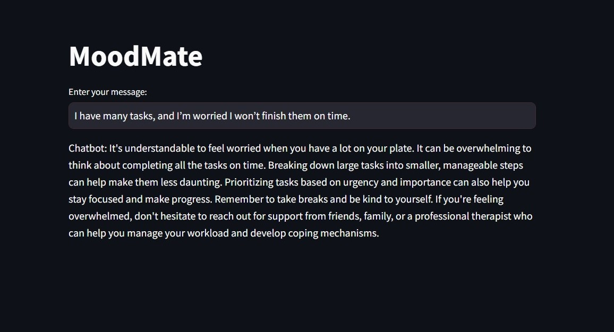

# MoodMate



## Description
MoodMate is a chatbot designed as a personal learning project to explore and practice skills in modern technologies like LangChain, FastAPI, and Streamlit. While it provides empathetic responses and basic emotional support, its primary goal is to demonstrate the integration of these tools in a functional, interactive application.

## Features
MoodMate demonstrates the integration of modern tools and frameworks to create a functional chatbot application:

### LangChain Integration:
- Implements `ConversationSummaryMemory` to provide context-aware interactions.
- Utilizes `ConversationChain` and Google’s LLM (ChatGoogleGenerativeAI) to power the chatbot's conversational logic.

### FastAPI Backend:
- Designed an API endpoint (`/chat`) to handle user inputs and return chatbot responses.

### Streamlit Frontend:
- Developed an interactive web interface to send user queries to the API and display responses.

### Docker for Containerization:
- Containerized the entire system, ensuring portability and ease of deployment.

### Google Cloud Run Deployment:
- Deployed the application online, making it accessible from anywhere.

## Table of Contents
1. [Installation](#installation)
2. [Usage](#usage)
3. [Environment Variables](#environment-variables)
4. [Deployment](#deployment)
5. [Project Structure](#project-structure)
6. [License](#license)
7. [Contact](#contact)

## Installation
To run MoodMate locally, follow these steps:

### Clone the repository:
```bash
git clone https://github.com/AhmedShetaia/moodmate.git
cd moodmate
```

### Install Docker:
Ensure Docker is installed and running on your system. [Download Docker](https://www.docker.com/products/docker-desktop/)

### Build and run the Docker container:
```bash
docker-compose up --build
```

### Access the application:
Open the Streamlit server using the link provided in the terminal output.

## Environment Variables
MoodMate requires a Google API Key to access Google’s LLM for powering chatbot interactions. Follow these steps to set it up:

### Obtain a Google API Key:
1. Visit the [Google Cloud Console](https://console.cloud.google.com/).
2. Create a new project or select an existing one.
3. Enable the Generative AI API or the relevant service.
4. Generate an API key from the **APIs & Services** section.

### Create a `.env` file inside the `api/` directory:
```bash
touch api/.env
```

### Add the API key to the `.env` file:
```env
GOOGLE_API_KEY=your-google-api-key
```
Replace `your-google-api-key` with the actual API key obtained from Google Cloud.

### Other environment variables:
Additional environment variables required for the system are specified in the Dockerfile and managed during containerization.

## Deployment
MoodMate is deployed using Google Cloud Run, enabling easy scalability and online accessibility. Follow these steps for deployment:

### Prerequisites
#### Google Cloud Account:
- Create a Google Cloud account.
- Ensure billing is enabled for your account.

#### Set Up Permissions:
1. Create a new project in Google Cloud (e.g., `moodmate-project`).
2. Enable the following services:
   - Cloud Run
   - Artifact Registry
   - Container Registry
3. Grant necessary IAM permissions for deployment (e.g., Cloud Run Admin, Storage Admin).

### Steps to Deploy

#### Step 1: Set Up Artifact Registry
1. Navigate to the Artifact Registry in the Google Cloud Console.
2. Create a new Docker repository:
   - **Repository name**: `moodmate-repo`
   - **Location**: Choose a region close to your user base.
   - **Format**: Docker.
3. Authenticate Docker with Google Cloud:

To authenticate Docker with Google Cloud, follow these steps:

##### Step 1: Generate the Access Token
Run the following command to generate and print your access token:
```bash
gcloud auth print-access-token
```
Copy the token from the output.

##### Step 2: Log in to Docker with the Token
Run the docker login command and paste the token when prompted for a password:

For Artifact Registry:
```bash
docker login -u oauth2accesstoken https://<region>-docker.pkg.dev
```
Replace `<region>` with your registry's region (e.g., us, europe, or asia).

Example:
```bash
docker login -u oauth2accesstoken https://us-docker.pkg.dev
```

##### Step 3: Paste the Token
When prompted for a password after running the docker login command, paste the token you copied in Step 1.

Example Output:
```bash
$ docker login -u oauth2accesstoken https://gcr.io
Password: 
Login Succeeded
```
Now, you are authenticated with Docker using the manually copied token.

#### Step 2: Build and Push Docker Images

##### Build the API backend Docker image:
```bash
docker build -t REGION-docker.pkg.dev/PROJECT_ID/moodmate-repo/api-backend ./api
```

##### Build the app frontend Docker image:
```bash
docker build -t REGION-docker.pkg.dev/PROJECT_ID/moodmate-repo/app-frontend ./app
```

##### Push the images to Artifact Registry:

###### API Backend:
```bash
docker push REGION-docker.pkg.dev/PROJECT_ID/moodmate-repo/api-backend
```

###### App Frontend:
```bash
docker push REGION-docker.pkg.dev/PROJECT_ID/moodmate-repo/app-frontend
```

#### Step 3: Deploy on Google Cloud Run

##### Deploy the API backend:
```bash
gcloud run deploy moodmate-api \
    --image REGION-docker.pkg.dev/PROJECT_ID/moodmate-repo/api-backend \
    --platform managed \
    --region REGION \
    --allow-unauthenticated
```

##### Deploy the app frontend:
```bash
gcloud run deploy moodmate-app \
    --image REGION-docker.pkg.dev/PROJECT_ID/moodmate-repo/app-frontend \
    --platform managed \
    --region REGION \
    --allow-unauthenticated \
    --set-env-vars API_URL=https://moodmate-api-YOUR_PROJECT_ID.REGION.run.app/
```

## Project Structure
The `moodmate/` project directory is organized as follows:

```plaintext
moodmate/
├── api/                      # Backend code for the chatbot API
│   ├── .env                  # Include your GOOGLE_API_KEY
│   ├── api.py                # API server entry point, handles requests and responses
│   ├── chatbot.py            # Core chatbot logic, including conversation management
│   ├── requirements.txt      # Dependencies required for the backend
│   └── Dockerfile            # Dockerfile for containerizing the backend
│
├── app/                      # Frontend application code
│   ├── app.py                # Streamlit app entry point, provides user interface
│   ├── requirements.txt      # Dependencies required for the frontend
│   └── Dockerfile            # Dockerfile for containerizing the frontend
│
├── images/                   # Project assets like screenshots
│   └── moodmate.png          # Screenshot of the MoodMate interface
│
├── .dockerignore             # Specifies files to exclude from Docker builds
├── .gitignore                # Specifies files to exclude from Git commits
├── docker-compose.yml        # Configuration for Docker Compose to run the project
└── README.md                 # Project documentation
```

## License
This project is licensed under the MIT License. See the [LICENSE](https://github.com/AhmedShetaia/MoodMate/blob/main/LICENSE) file for details.

## Contact
Feel free to connect with me on [LinkedIn](https://www.linkedin.com/in/ahmed-shetaia/). I’d love to hear your feedback, discuss the project, or collaborate on future ideas!
